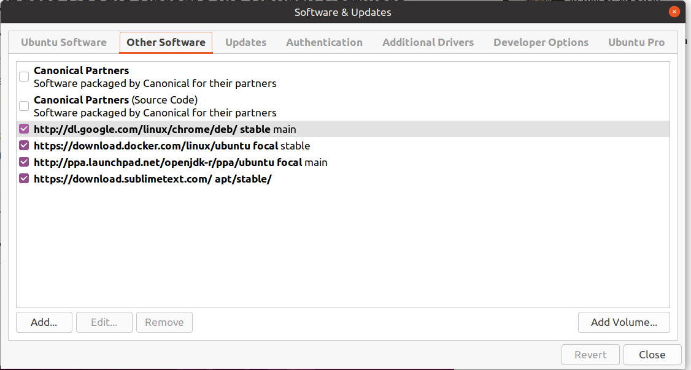

* [Install and update Google Chrome](#google-chrome)

### Google Chrome

##### Installation

It is installed via `java_dev_environments` project as:
```yaml
  - name: Chrome browser
    package: google-chrome-stable
    repo: "deb [arch=amd64] http://dl.google.com/linux/chrome/deb/ stable main"
    apt_key: "https://dl.google.com/linux/linux_signing_key.pub"
```

##### Google Chrome Update

1. Google Chrome adds a repository to your sources.list directory:


As result Google Chrome will be updated along with the system updates provided by Ubuntu via the Software Updater.

2. Update via CLI:
```bash
sudo apt update 
sudo apt --only-upgrade install google-chrome-stable
```